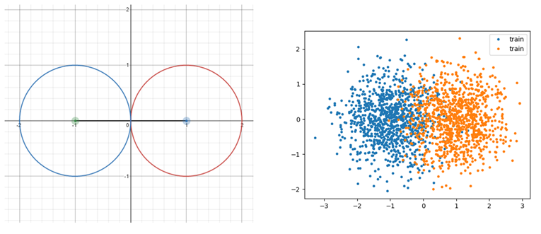
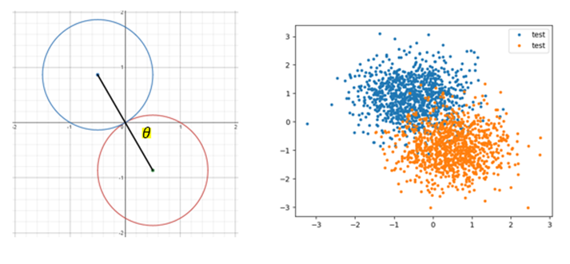
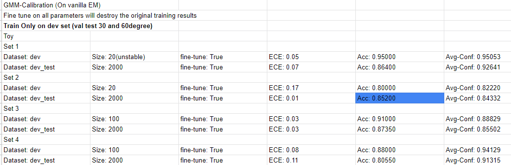
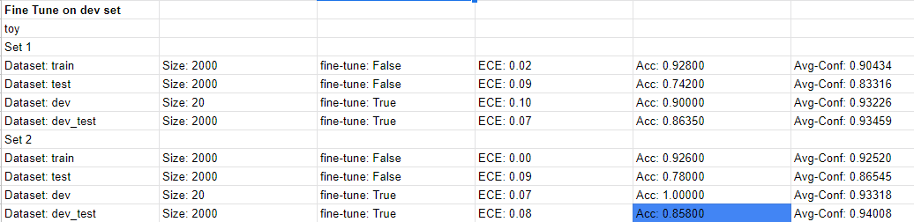
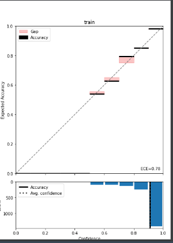

Background: For Expectation Maximization and GMM clustering algorithm,
one hypothesis for miscalibration for the test set is that:
the test set does not follow the same distribution as the training set. 
The proposed solution is to use a small set of data that is closer to testing
data distribution to fine tune the model.
Therefore, two sets of experiments are designed for investigation: Toy dataset and MNIST dataset. 

### Toy
Toy datasets are randomly generated data points on a 2d plane.
They follow guassian distribution. Covariance shift is controlled
by angle \theta

Training data

Testing data

### MNIST
Covariance shift for MNIST data is done by adding gaussian noise. 
Both set of experiment arrived at the same conclusion, that is, results
highly depend on training data. Also, decrease in ECE mainly comes from increase 
in accuracy, while average confidence remains unchanged. 
Therefore, only results for toy dataset is shown.

### Experiment results
Dataset naming

train: training data
test: testing data trained model
dev: Fine tune data
dev_test: testing data after model after fine tune

Results for normal training. Trained with dev set

Results for normal training followed by fine tune.

### Code
run `python torch_gmm.py`. The results will be printed in the console.

line 146 in `torch_gmm.py` should plot a reliability diagram shown below
